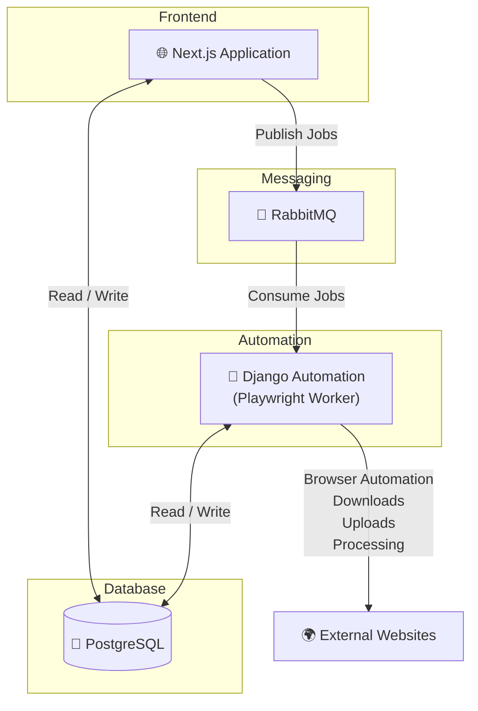

```mermaid
flowchart TB
    subgraph Frontend
        NEXT["🌐 Next.js Application"]
    end

    subgraph Messaging
        MQ["🐇 RabbitMQ"]
    end

    subgraph Automation
        DJ["🤖 Django Automation<br/>(Playwright Worker)"]
    end

    subgraph Database
        PG[("🐘 PostgreSQL")]
    end

    NEXT <-->|Read / Write| PG
    NEXT -->|Publish Jobs| MQ
    MQ -->|Consume Jobs| DJ
    DJ <-->|Read / Write| PG

    DJ -->|Browser Automation<br/>Downloads<br/>Uploads<br/>Processing| EXT["🌍 External Websites"]
```